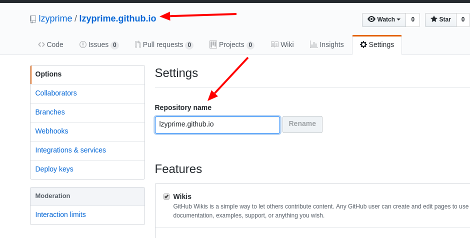
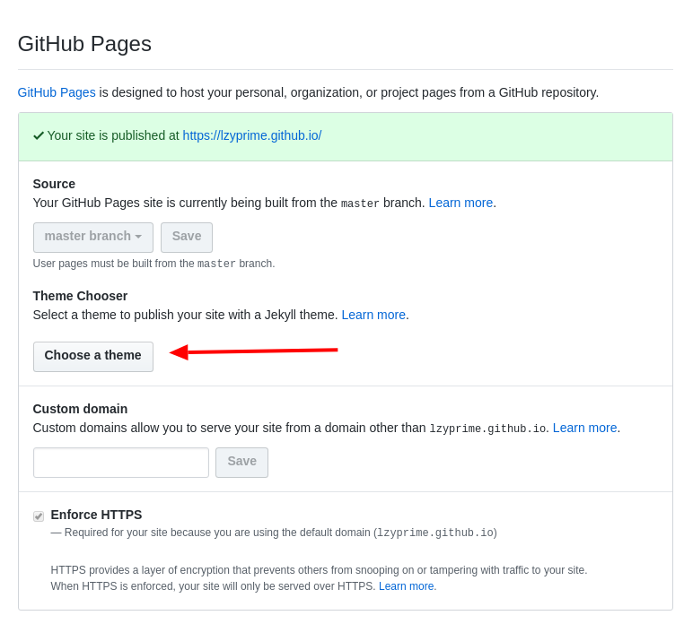
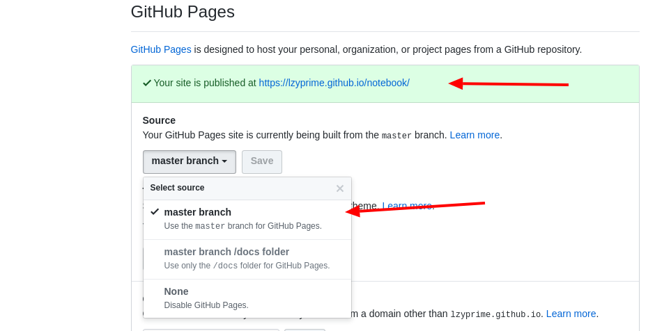

# [我的博客](https://lzyprime.github.io) 搭建过程 hexo + github

> ## 正题之前，先扯扯 ：
> 终于搭好了一个比较满意的博客（[先来看看，打个赏？ - 博客地址](https://lzyprime.github.io)）。用github + hexo 。此前用jekyll , 但是好笨重，改起来麻烦，自定义的东西少，大概模板长什么样，博客就长什么样，学起来麻烦，安的东西多。路径管理麻烦，文件格式麻烦……  
然后读了 hexo 的文档，搜了几篇教程，大概就明白了。重点是找了一个有良心 wiki 的主题叫 mellow 。 主题作者 写了详细的 wiki ： 主题怎么用，主题某些样式怎么改，目录怎么组织，文章头 ， 自定义界面模板 ……  
> ### 够用了，足够用来改成想要的样子。
> hexo 安装简单，安的东西少，官方文档也写的 简洁，清楚。  
> ### emm,挺好的

## 0. github 与 博客

github 上 可以创建一个 名为 `用户名.github.io` 的 `repository`,在里边扔网页代码，然后就能通过网址 `https://用户名.github.io` 访问网页。这就是博客地址 (不能别的名)  



然后设置里往下翻，会有 Github Page 的选项，内置了几个主题 `choose theme` 后，会把 `README` 里的内容生成网站首页，并多出个 `_config.yml` 文件。 （自己实验一下）， **文件路径是按照，repository 里的构建的** （这句话以后就懂了）


> 还有个 `Source` 选项，在 `用户名.github.io` 下改不了，这是给其他 `repository` 准备的,其他项目代码里也有 github page 的设置。假设你有一个 `repository` 叫 **notebook** ，在 Source 可以设置用哪个分支（默认master） 作为该项目的显示内容，或者分支下的 特定文件夹（docs） 里的东西作为显示内容, 然后通过 `http://用户名.github.io/notebook` 访问。  
比如我的 notebook 工程，选择 master 为显示内容，github 提醒 可以通过网址 [https://lzyprime.github.io/notebook/](https://lzyprime.github.io/notebook) 访问。  
首页就是工程里的 README 的内容，markdown 写的，链接路径就根据文件实际地址填就可以。这是默认主题好处之一，文件就是这么组织的  【 后边就能领悟什么意思了 ：） 】

### 但是博客工程 （`repository : 用户名.github.io`） 里定死用 master 作为网页内容，没法选其他的。也就是说 master 里有什么，访问给的网址时就显示什么。

## 1. 用自定义主题 - hexo

hexo 干的事就是 把所有要显示的页面在本地生成好，然后扔到 master 分支里。

- 按照官方文档，[安装 hexo](https://hexo.io/zh-cn/docs/)，（重启或 `执行 source .profire` 让环境变量生效，之后再说安装的坑）。
- 新建一个文件夹（如： blog）, `hexo init blog`
- 然后下载主题 mellow,放到 `blog/theme/` 文件夹里。 [我的博客主题](https://github.com/lzyprime/hexo-theme-mellow) 。。。[原模板主题,来自condefine 的 mellow](https://github.com/codefine/hexo-theme-mellow)
- 在 blog 下，`npm install` ， 会报错，因为 mellow 需要功能插件，去看 [mellow wiki](https://github.com/codefine/hexo-theme-mellow/wiki) 的解决 。之后主题魔改也是来自 wiki 。
- 然后 blog 里有一个 _config.yml 文件，默认配置文件，找到一行 `theme: ...` 把默认的换成 mellow : `theme: mellow`
- 命令 ： `hexo g` 根据 source 文件夹里的东西生成所有网页，`hexo s` 扔到本地服务器，用来预览长什么样。
- `hexo d` 扔到远程，之后再说。

## 2. 改配置文件 _config.yml [参考hexo文档各项设置内容](https://hexo.io/zh-cn/docs/configuration)

> ### **一共有两个要改** blog/_config.yml 和 theme/mellow/_config.yml
>所有项都是 `配置名: 值` 的形式，**冒号后一定跟一个空格**  

## 2.1 blog下的 _config.yml （以我的为例）

```yml
# 这些你都空着都没关系，大不了什么都不显示

title: I'm prime #大标题
subtitle: 十方三世，尽在一念 #小标题
description:   #描述，个性签名之类的，我每天
keywords:   # 关键词 (穷折腾，闲得疼) ？
author: prime
language:  # 语言这项得看支持那些语言
timezone:
```

```yml
# 自定义网页地址长什么样

url: https://lzyprime.github.io # 网页地址,之后所有网页会在这个地址之后拼接
root: / #网页文件所在根目录

permalink: :title/      #网页拼接形式,默认： :year/:month/:day/:title/ ，如果你有一篇文章 helloworld.md ,title: hellowd ,创建于 2018.8.6 ,生成的网站链接就会是 lzyprime.github.io/2018/8/6/hellowd/ ,所以我改成了只要title,链接就成了 lzyprime.github.io/hellowd . 当然可以定其他的关键字，比如 ：aaa/: bbb/:ccc/ ,然后在文章头里设定 aaa: one bbb: two ccc: three, 文章链接就成了 https://lzyprime.github.io/one/two/three/

permalink_defaults:     ## 网页默认拼接。用处： 每篇文章 拼接时各部分的默认值，比如你的 permalink 用自定例子里的，这里就可以指定 ：r/：rr/:rrr/ ,如果找不到 permalink 在文件头里找不到 aaa bbb ccc 的对应值，就会用这组。 lzyprime.github.io/r/rr/rrr/
```

```yml

# Directory 东西往哪存

source_dir: source   #生成网页用的原文件放哪，默认 source 文件夹, 里边 _post 文件夹里就是所有文章
public_dir: public      #生成的网站文件放哪。hexo 把 source 里的内容（xxx.md），每一篇结合主题（mellow）生成对应的 xxx.html。然后放到 public 文件夹里。 public 就相当于 路径 lzyprime.github.io 。 public 里的东西会根据这个路径拼接，如 要访问网页lzyprime.github.io/vscode/ 对应public/vscode/index.html 文件。  也就是说，source 里的每个xxx.md 文件会根据source路径建一个文件夹，里边有个 index.html 就是要显示的内容。  什么叫根据 source 路径？ ： soure/_post/vscode/ides.md ---> public/vscode/ides/index.html ----> lzyprime.github.io/vscode/ides
# PS ： 会跳过 .xxx 文件夹， _xxx 文件夹不跳过，但是地址跳过： source/_post/xxx.md 会被搜到，但认为路径是 : source/xxx.md。 懂了 ？

tag_dir: tags       # 文件头里写 tags: [i1,i2,i3] ,在 public 会有 tags 文件夹，对应 i1,i2,i3 文件夹， tags/i1/index.html 按标签查看时要显示的内容
archive_dir: archives    # 跟 tags 一样，会有对应文件夹，按照地址层层往里
category_dir: categories     # 跟 tags 一样，在文件头里 category ，根据文件头建文件夹

## 剩下的用不着多少，看官方文档了解
code_dir: downloads/code
i18n_dir: :lang
skip_render:

```

> ### 也就是说，远程仓库 master 分支里，只需要放 public 里的东西。

```yml
# 其他
post_asset_folder: true      # 相对路径吗？ 如果是true,source 生成到public 时，会保留原来路径格式，比如source/_post/one/two/three.md ----> public/one/two/three/index.heml。 如果是false : public/three/index.html 

#用处 ： 之前讲了 source ---> public 的过程 ， 所以如果你的文章里设置了 图片资源链接，或者其他文章的链接，生成 public 文件时，就会出问题， 比如 文章 vscode.md 里引用 vscode/ides.md ,本地文章就这么写就行对吧，但是生成 public 变成什么？  ---> public/vscode/index.html 引用了 vscde/ides.md ，全路径应该是 public/vscode/vscode/ides.md 显然没有，所以要改成 vscode/ides/ ,这样相当于路径 public/vscode/vscode/ides/index.html 对吧？

#图片资源 ： 放到 source/_post/vscode/ 文件夹里， 文章 source/_post/vscode.md 里本地写引用 是 vscode/x1.png 对吧，但是显示的时候又找不到 ，因为 public/vscode/x1.png public/vscode/index,html , 这是生成网页后两个文件的地址，他俩同级，所以 vscode.md 中引用 应该直接写 x1.png 。生成网页后才对。

## 总结一下 ： 如果一篇文章 example.md 要引用 图片或者其他资源，那就建一个同名的文件夹 example/ 东西扔到这里边，引用直接填名字，当然文章的话去掉后缀（如上例子）

relative_link: true ## 看官网文档

theme: mellow
```

```yml
# 向 远程仓库的提交
deploy:
  type: git
  repository: https://github.com/lzyprime/lzyprime.github.io.git
  branch: master
```

> ### hexo g 生成完public , 你可以手动把public 里的东西推到远程。当然 hexo 自带了方法（如上），在配置最后边，有 deploy 项，设置好后，每次`hexo g`生成完，执行 `hexo d`，就会自己推到远程，和git push 一样。
> ### 第一次使用会提示找不到 git ？ 需要安装 hexo 的插件  
>`npm install hexo-deployer-git --save`  
然后就能推送了，命令连写 : `hexo g -d` 生成并推送，其他也支持连写

## 2.2 theme/mellow/_config.yml [设置主题细节,wiki](https://github.com/codefine/hexo-theme-mellow/wiki/2.-主题常规配置)

注释里写的很清楚，没什么了，， 用什么开什么，不用就注释掉

```yml
头像底下的那几个小图标 ：

图标是fontawesome图标，只需要写图标名。http://fontawesome.dashgame.com/ ，网站前缀设好了，只需要去网站找合适的图标，然后写名字

新连接规则[name]: url | icon
menu_link:
  github: https://github.com/lzyprime | github
  music: https://music.163.com/#/user/home?id=395181365 | music
  简书: https://www.jianshu.com/u/3ce5b376d814 | book

```

```yml
左侧导航栏自定义 ： 图标同上
# 添加新菜单项遵循以下规则
## menu:
##  link:               [必要][不渲染] 用于区分类别
##    icon: _blank      [必要][渲染] 菜单图标。使用内置fontawesome图标，省略前缀
##    text: About       [必要][渲染] 菜单文字信息
##    url: /about       [必要][渲染] 菜单链接，绝对或相对路径。
##    target: _blank    [必要][不渲染] 是否跳出，省略则在当前页面打开
menu:
  home:
    text: 主页
    url: /
    icon: home
  repo_list:
      text: 项目列表
      url: /repolist
      icon: code
  th-list:
    text: 文章分类
    url: /categories
    icon: th-list
  tags:
    text: 标签
    url: /tags
    icon: tags
  archives:
    text: 所有文章
    url: /archives
    icon: archives
  notebook:
    text: 我的笔记
    url: /notebook  ## 拼接之后：lzyprime.github.io/notebook/
    icon: stack-overflow
  about:
    text: 我
    url: /about
    icon: user
  gitee:
    text: 码云主页
    url: https://lzyprime.gitee.io ## 支持完整路径
    icon: link
    #demo:
    #text: CUSTOM
    #url: /custom
    #icon: plus-square
    #github:
    #url: https://github.com/lzyprime
    #target: _blank
    #icon: github
```

```yml
# 首页是否开启置顶标志
top_icon: true #在文件头里写 top: 数字，，数字越大越靠前。


网站最下端一行小字，显示链接
#####################
####   页脚配置    ###
#####################

# 友情链接
blogroll:
  item1:
    name: 主页
    url: https://lzyprime.github.io
  item2:
    name: 简书
    url: https://www.jianshu.com/u/3ce5b376d814
  .
  .
  .
 # 其他的评论之类的功能，想配就按着 wiki 里来。
```

## 3 文章和个别页面

## 3.1 文章就放到 source/_post/ 下，怎么 从 source 到 public 前边 blog/_config.yml 里写了。。

```markdown
格式 ： xxx.md
内容：
---
title: title #标题
date: 2017-11-07 09:56:27 #创建时间
tags: [tag1, tag2] #标签(同级)
categories: #分类(分层)
    - cat1
    - cat2
    - cat3
reward: false #是否开启打赏功能
comment: false #是否开启评论功能
top: 1 #置顶层级(数字越大，优先级越高)
repo: codefine | hexo-theme-mellow #用户名 | 仓库名
src: https://i.loli.net/2017/12/12/5a2fd18a74471.jpg #主页摘要缩略图(外链以及相对资源均可)
aaa: one
bbb: two
ccc: tree
---

# 1
## 2
### 3
```

> ### 三个横杠(不能多，不能少) 里夹的内容就是文件头，设置标签，分类，其他信息……，比如之前例子里的 aaa bbb ccc
> **PS:** tags 见文件夹 tags/tag1 tags/tag2 , 而 categories 是 categories/cat1/cat2/cat3/ 。显示效果就是 属于 cat1>cat2>cat3 。

## 3.2 tags all页面,categories all页面

生成网页预览时，可能会出现单独点击某个标签，可以显示网页，当点 All 标签, 或者从左侧点击标签时，就找不到网页了，，同理 categories 。
去 public/tags/ 里查看，根本就没有 index.html 文件

解决: 生成一个 index.html 就好了。。 去 source 里 建一个 `tags.md` 文件头里指定 layout: tags, 主题里有 tags 和 categories 的样式

```txt
---
title: tags
layout: tags
---

同理 categories
---
layout: categories
---
```
其实应该去改 _config.yml 里的东西。 但是，为了省事……

就建个空文件，不用内容。

## 3.3 自定义页面 如： /about

在 theme/mellow/_config.yml 里设置了左侧导航，有些自定页面，比如 /about 。 不会自己生成，因为 souce 里也没有。

```bash
hexo [layout] <filename>
#layout 可以任意指定主题里带的一个，如果不写或者，没有所说的layout，默认会是 layout: post （在blog/_config.yml 里设默认值）

hexo page about # 新建 about 页 在source 里会有 source/about/index.md

同理其他网页也是这样 , 或者手动创建也可以，按照 source --> public 的原理。
```

## Pro 一下，自带模板的自定义

这一项之上的内容，基本就能建个好博客了，总结一下 ：

- 安装hexo 和 喜欢的主题（[官网一堆模板](https://hexo.io/themes/)） ， 然后改一下配置文件（两个_config.yml）
- 把东西扔到 source 里 ， 按照 source ---> public 的路径转换，组织你的文件。
- hexo g ---> hexo s 预览一下效果 ---> hexo d 或者 git push 扔到远程。

对，就这三步这么简单， `_config.yml , source ---> public ，文件头` , 弄明白就没问题了。。

> ### 如果模板和配置还不合意，你就要自己动前端代码了……
> 比如我的主题，最上头的图片加宽了，，文章显示页加宽了，左侧栏淡化了……  
mellow 的 wiki 给了一部分元素的说明，你可以小改。

> 你也可以自己写页面模板，放到 _custom 文件夹里， layout: 自定义 ，或者直接在 source 里写 index.html。生成时会原封不动的过去。  
总之就是前端，你会就自己造轮子。不会？ 找个好点的模板，小改一下将就着用呗。

## 这么详细还不懂？ 来，付费我给你造：）

## 还有问题可以问我。

## [我的博客](https://lzyprime.github.io)