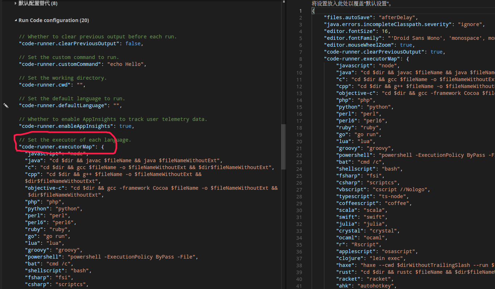
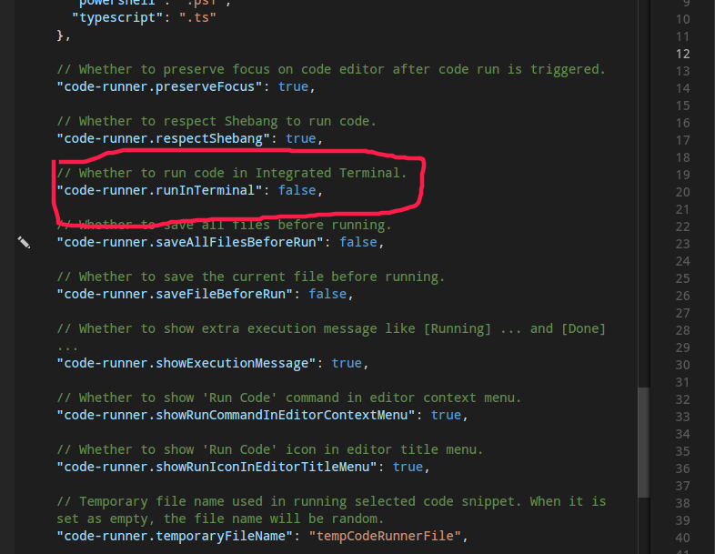

# vscode 简单配置和使用

## [vscode官网链接](https://code.visualstudio.com/)

<!--more-->

> 好用的记事本。通过安装插件，实现简单ide功能，但是工程代码之类的，还是用ide吧,而且免折腾，开箱即用  ----  [人生苦短，我用IDE](ides.md)

## 1.插件

> 打开相关文件时,vscode会自动推荐插件基本够用

- c++ //Linux下基本两个就够，如果用的是clang,把clang安上
  - c/c++ // 基础插件，实现格式化代码等，代码监测
  - c++ Intellisense // 更好的补全等
- Java Extension Pack // java 自动推荐，是多个插件的集合，java够用。用户代码段，格式化代码，实时代码监测
- Code Runner // 编译运行程序，把命令封装成快捷键
- markdown
  - markdownlint
  - Markdown Preview Github Styling //github预览样式
- 主题 // Ctrl+k,t 更换主题，随便在商店里找
  - monokai light
  - Atom One Light Theme
- vscode-pdf //在 vscode 里看pdf

## 2.设置

> ### vscode 的设置方法：通过右侧的手动配置内容，覆盖掉左侧默认的。简单json格式。

### 2.1通过code runner ,实现编译，运行代码  

将 *code-runner.executorMap* 的内容复制到右侧（鼠标停在左侧笔上会出 *复制到右侧* 的选项），后边是对应语言 在按下快捷键时 会执行的命令，默认在控制台下运行，所以如果要输入数据，要从文件输入。  
写完代码后，Ctrl+alt+n,就相当于在终端里执行引号里的代码。具体要执行什么，自定义



```json
//主要用来跑 java,cpp
 "code-runner.executorMap": {
        "java": "cd $dir && javac $fileName && java $fileNameWithoutExt <input >output && cat output",
        "c": "cd $dir && gcc $fileName && ./a.out <input >output && cat output",
        "cpp": "cd $dir && g++ $fileName && ./a.out <input >output && cat output"
    },
```

如果想在终端下执行这条命令，code runner 提供了在终端运行的选项，默认在集成终端



复制到右侧，设为true,这样ctrl + alt + n 的时候，会打开集成终端，然后跑那一长串命令，解决输入数据的问题。  
当然你也可以在终端里手动编译或执行命令（集成终端ctrl + `）

```json
//code runner 其它选项，看个人喜好。
"code-runner.clearPreviousOutput": true, //清除之前的输出
"code-runner.saveFileBeforeRun": true //运行前保存文件
...略...
```

### 2.2 自定义字体大小，主题，按住ctrl + 滚轮 缩放等等

```json
 "editor.fontSize": 18,
    "editor.mouseWheelZoom": true,
    "workbench.colorTheme": "Monokai Light",
```

### 2.3 我的配置备份

```json
{
    "editor.fontSize": 18,
    "editor.mouseWheelZoom": true,
    "workbench.colorTheme": "Monokai Light",
    "code-runner.clearPreviousOutput": true,
    "code-runner.executorMap": {
        "javascript": "node",
        "java": "cd $dir && javac $fileName && java $fileNameWithoutExt <input >output && cat output",
        "c": "cd $dir && gcc $fileName && ./a.out <input >output && cat output",
        "cpp": "cd $dir && g++ $fileName && ./a.out <input >output && cat output"
    },
	"code-runner.saveFileBeforeRun": true,
	"files.autoSave": "afterDelay",
	"explorer.confirmDelete": false,
	"explorer.confirmDragAndDrop": false
}
```

> #### 其他配置看个人需求自己决定

## 3. 奇淫巧技 

### 3.1 用户代码段

> 就是输入关键字，会插入设定好的一段代码。  
比如c++,每次都要include一堆，然后using ... ，然后main 函数，，完全可以设置成用户代码段，只需要输入cpp关键字就生成这一堆代码。  
方法：ctrl + shift + P  输入snip，或者点击设置框里的用户代码段，选择对应语言。里边会带教程，告诉你怎么配置

```json
// 把example 的注释去掉
"bits": { // 这个代码段的名字,随便起
		"prefix": "bits", // 绑定的关键字
		"body": [ // 输入 bits 时，生成的内容,每行内容包含在双引号里，用逗号间隔，支持制表符\n \" 之类的，就当是c语言的 printf里的内容。
			"#include <bits/stdc++.h>",
			"using namespace std;",
            "\nint main()\n{\n\t$0\n\treturn 0;\n}" //$0 光标出现的位置，如果不设置，默认出现在末尾
/*
如果需要多个参数，分别用$1,$2,$3...代替，然后用tab,切换到下一个参数位置。
比如while 的body里:
"while($1)\n{\n$2\n}"
输入完第一个条件后，按tab，跳转到$2的位置，开始写循环内容
（还不明白就自己实验）
*/
		],
		"description": "c++ 11"//对这个代码段的简单描述
	}
```
> 用户代码段大概就这么写，用什么自己配，多个段之间逗号间隔（json 语法）

#### 我的 c++ 用户代码段

```json
{
	"bits": {
		"prefix": "bits",
		"body": [
			"#include <bits/stdc++.h>",
			"using namespace std;",
			"\nint main()\n{\n\t$0\n\treturn 0;\n}"
		],
		"description": "c++ 11"
	},
	"cpp": {
		"prefix": "cpp",
		"body": [
			"#include <iostream>",
			"#include <cstdio>",
			"unsing namespace std;",
			"\nint main()\n{\n\t$0\n\treturn 0;\n}"
		],
		"description": "c++"
	}
}

PS: 常用文件IO(freopen) ， 没配，因为code runner 里设置了从文件输入输出 (<input > output) 。:-)
```

#### Java 用户代码段，之前那个插件包里就自带了，代码补全也差不多，和ide里的补全差不多

### 3.2 格式化代码

> 很多ide里也自带功能，就是有点丑。vscode 格式化代码段依赖 语言的基础插件，比如 c/c++ ，java support 之类的，然后就可以 右键、格式化代码段了（选中部分或者全局）。
Linux 下快捷键 shift + ctrl + i, 在快捷键表里查或自定义

### 3.3 好用快捷键

> 打开快捷键对照表，里面一堆，比如  
ctrl+enter 跳到下一行插入， Ctrl + shift + enter 跳到上一行插入代码  
shift + del 删除一整行，跳到上一个关键词，下一个关键词  
Ctrl + / 加注释，或者整块注释。  
...略...（快捷键表）

### 3.4 光标骚操作

- 按住 alt, 单击鼠标，在多个位置添加光标

- shift + alt 然后拖拽，选中块，或者连续添加光标

- ...略...

## 更多玩法自己发现，大概就是靠 设置，插件，自带功能实现

# [我的博客](lzyprime.github.io)
